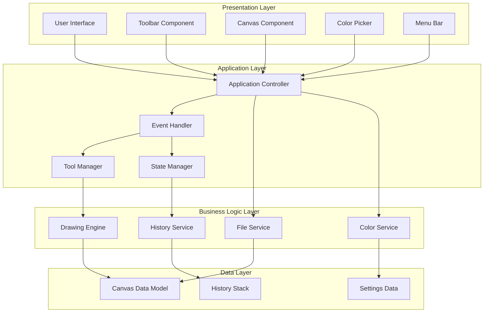
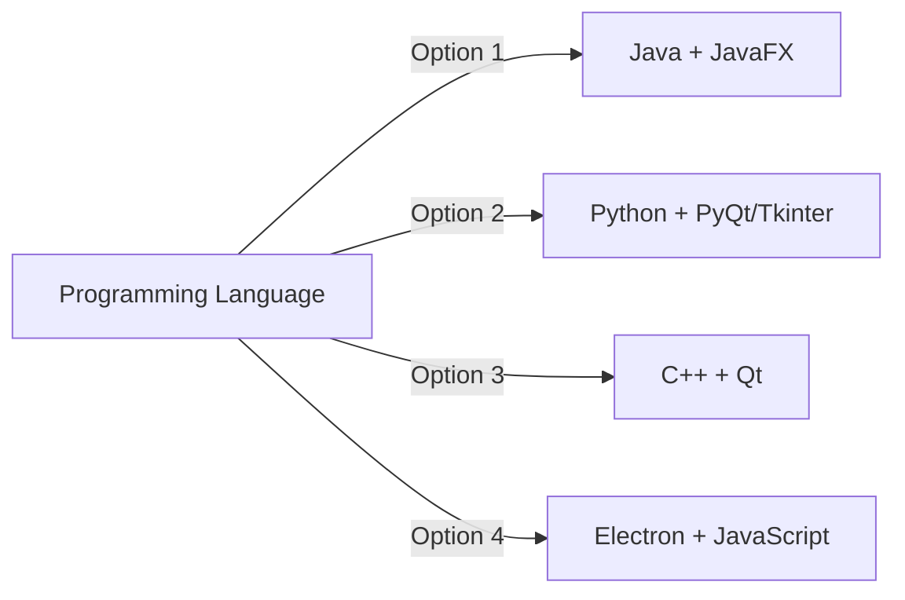
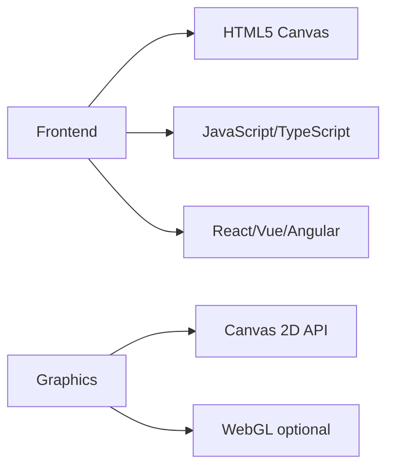
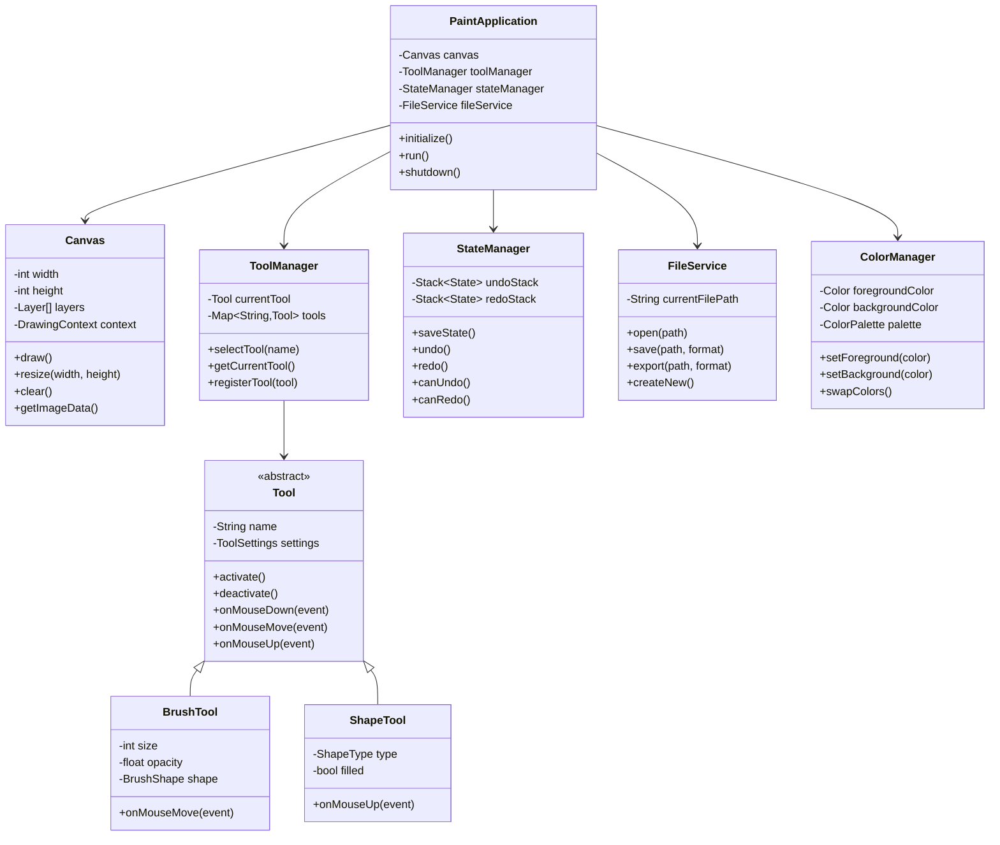
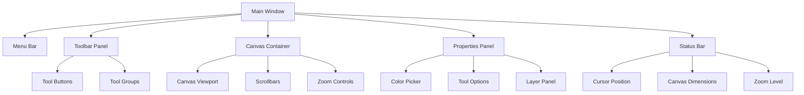
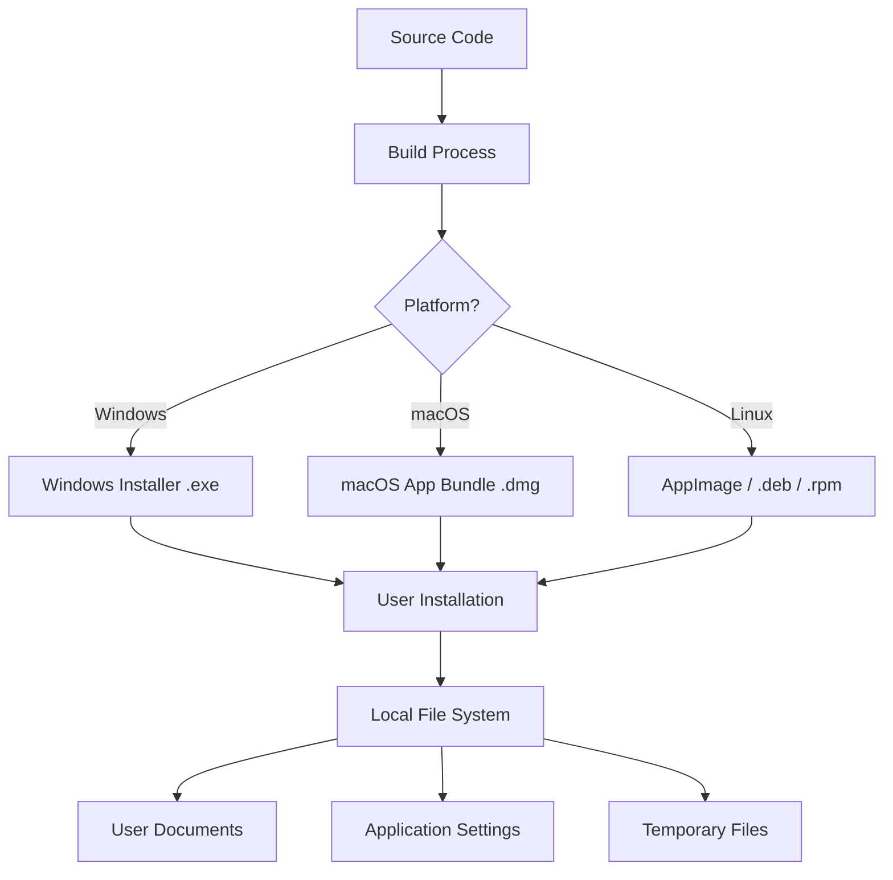
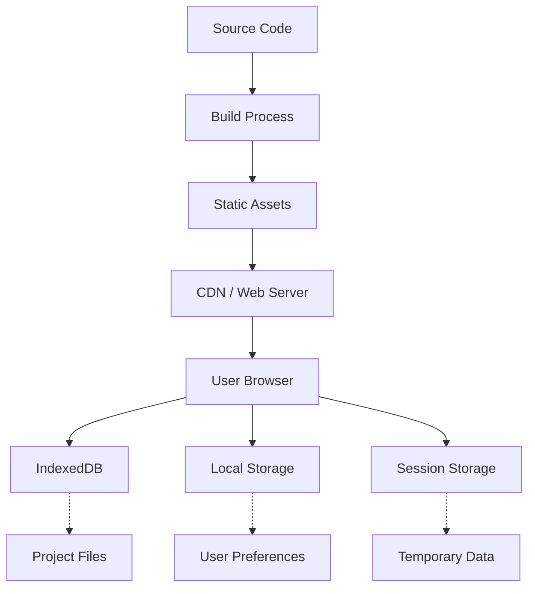

# Paint Application - System Architecture

## Table of Contents
1. [Overview](#overview)
2. [System Architecture](#system-architecture)
3. [Component Design](#component-design)
4. [Technology Stack](#technology-stack)
5. [Class Structure](#class-structure)
6. [Data Models](#data-models)
7. [User Interface Design](#user-interface-design)

## Overview

This document provides a high-level architectural overview of the Paint Application. The application follows a Model-View-Controller (MVC) pattern with event-driven architecture for handling user interactions.

### Key Features
- Drawing tools (brush, pencil, eraser, shapes)
- Color selection and palette management
- File operations (open, save, export)
- Undo/Redo functionality
- Layer support (optional)
- Multiple export formats

## System Architecture

### High-Level Architecture Diagram



## Component Design

### 1. User Interface Components

#### Canvas Component
- **Responsibility**: Main drawing surface
- **Features**:
  - Real-time rendering of drawing operations
  - Mouse/touch event handling
  - Zoom and pan capabilities
  - Grid and ruler display (optional)

#### Toolbar Component
- **Responsibility**: Tool selection and configuration
- **Tools**:
  - Selection tools
  - Drawing tools (brush, pencil, pen)
  - Shape tools (line, rectangle, circle, ellipse, polygon)
  - Eraser
  - Fill bucket
  - Text tool
  - Eyedropper

#### Color Picker Component
- **Responsibility**: Color selection and management
- **Features**:
  - RGB/HSV color picker
  - Color palette
  - Recent colors
  - Custom color creation
  - Foreground/background color selection

#### Menu Bar Component
- **Responsibility**: File and edit operations
- **Menus**:
  - File (New, Open, Save, Save As, Export, Exit)
  - Edit (Undo, Redo, Cut, Copy, Paste, Clear)
  - View (Zoom In, Zoom Out, Fit to Screen, Grid, Rulers)
  - Image (Resize, Rotate, Flip)
  - Help (About, Tutorial)

### 2. Application Layer Components

#### Application Controller
- **Responsibility**: Coordinate between UI and business logic
- **Functions**:
  - Initialize application
  - Handle user interactions
  - Manage application state
  - Coordinate component communication

#### Event Handler
- **Responsibility**: Process and dispatch user events
- **Events**:
  - Mouse events (down, move, up, click, double-click)
  - Keyboard events (shortcuts, modifiers)
  - Touch events (for touch-enabled devices)
  - Window events (resize, focus, blur)

#### Tool Manager
- **Responsibility**: Manage drawing tools and their behaviors
- **Functions**:
  - Tool selection and activation
  - Tool-specific settings management
  - Tool state persistence
  - Custom tool registration

#### State Manager
- **Responsibility**: Manage application and canvas state
- **Functions**:
  - Track drawing state (isDrawing, current tool, etc.)
  - Manage undo/redo stacks
  - Handle state persistence
  - State validation

### 3. Business Logic Components

#### Drawing Engine
- **Responsibility**: Core drawing operations
- **Capabilities**:
  - Render strokes with various brushes
  - Draw geometric shapes
  - Apply effects and filters
  - Handle anti-aliasing
  - Manage layers (if supported)

#### File Service
- **Responsibility**: File I/O operations
- **Supported Formats**:
  - Native format (.paint, JSON-based)
  - PNG (lossless, with transparency)
  - JPEG (lossy compression)
  - BMP (uncompressed)
  - SVG (vector export)

#### Color Service
- **Responsibility**: Color management and conversion
- **Functions**:
  - RGB ↔ HSV conversions
  - Color validation
  - Palette management
  - Color history tracking

#### History Service
- **Responsibility**: Undo/Redo management
- **Features**:
  - Configurable history size
  - Memory-efficient state storage
  - Batch operations support
  - History compression

## Technology Stack

### Recommended Technologies

#### Desktop Application


#### Web Application


### Core Technologies

1. **Graphics Rendering**:
   - Canvas API (Web)
   - Graphics2D (Java)
   - QPainter (Qt)
   - Cairo (Python)

2. **Data Storage**:
   - JSON for settings and project files
   - PNG/JPEG libraries for image export
   - SQLite (optional, for complex projects)

3. **UI Framework**:
   - Platform-specific UI toolkit
   - Custom widgets for specialized controls

## Class Structure

### Core Classes



## Data Models

### Canvas Data Model

```javascript
{
  "version": "1.0",
  "canvas": {
    "width": 800,
    "height": 600,
    "backgroundColor": "#FFFFFF"
  },
  "layers": [
    {
      "id": "layer-1",
      "name": "Background",
      "visible": true,
      "opacity": 1.0,
      "blendMode": "normal",
      "imageData": "base64-encoded-image-data"
    }
  ],
  "metadata": {
    "created": "2025-01-01T00:00:00Z",
    "modified": "2025-01-01T00:00:00Z",
    "author": "User Name"
  }
}
```

### Tool Settings Model

```javascript
{
  "currentTool": "brush",
  "toolSettings": {
    "brush": {
      "size": 10,
      "opacity": 1.0,
      "hardness": 0.5,
      "spacing": 0.25,
      "color": "#000000"
    },
    "eraser": {
      "size": 20,
      "hardness": 1.0
    },
    "shape": {
      "type": "rectangle",
      "filled": false,
      "strokeWidth": 2,
      "color": "#000000"
    }
  }
}
```

### Application Settings Model

```javascript
{
  "ui": {
    "theme": "light",
    "language": "en",
    "showGrid": false,
    "showRulers": true
  },
  "canvas": {
    "defaultWidth": 800,
    "defaultHeight": 600,
    "defaultBackground": "#FFFFFF"
  },
  "history": {
    "maxUndoSteps": 50,
    "autosaveInterval": 300
  },
  "shortcuts": {
    "undo": "Ctrl+Z",
    "redo": "Ctrl+Y",
    "save": "Ctrl+S",
    "brush": "B",
    "eraser": "E"
  }
}
```

## User Interface Design

### Layout Structure

```
┌─────────────────────────────────────────────────────────┐
│  Menu Bar [File] [Edit] [View] [Image] [Help]          │
├─────────────────────────────────────────────────────────┤
│ ┌─────┐                                                 │
│ │ T   │  ┌────────────────────────────────────────┐    │
│ │ o   │  │                                        │    │
│ │ o   │  │                                        │    │
│ │ l   │  │                                        │    │
│ │ s   │  │                                        │    │
│ │     │  │         Canvas Area                    │    │
│ │ P   │  │                                        │    │
│ │ a   │  │                                        │    │
│ │ n   │  │                                        │    │
│ │ e   │  │                                        │    │
│ │ l   │  └────────────────────────────────────────┘    │
│ └─────┘                                                 │
│ ┌─────────────────────────────────────────┐             │
│ │  Color Picker & Tool Options            │             │
│ └─────────────────────────────────────────┘             │
├─────────────────────────────────────────────────────────┤
│  Status Bar: [Tool: Brush] [Size: 10px] [Pos: 120,45]  │
└─────────────────────────────────────────────────────────┘
```

### Component Hierarchy



## Deployment Architecture

### Desktop Application Deployment



### Web Application Deployment



## Performance Considerations

### Optimization Strategies

1. **Rendering Optimization**:
   - Use double buffering to prevent flicker
   - Implement dirty rectangle rendering
   - Cache rendered content when possible
   - Use hardware acceleration where available

2. **Memory Management**:
   - Limit undo/redo stack size
   - Compress historical states
   - Release unused resources promptly
   - Use image pyramids for large canvases

3. **Responsiveness**:
   - Debounce high-frequency events
   - Use web workers / background threads for heavy operations
   - Implement progressive rendering for complex scenes
   - Show loading indicators for long operations

## Security Considerations

1. **File Operations**:
   - Validate file formats before loading
   - Sanitize file names
   - Implement file size limits
   - Handle malformed files gracefully

2. **User Data**:
   - Store user preferences securely
   - Implement autosave with corruption recovery
   - Validate user inputs
   - Prevent injection attacks in export functions

## Future Enhancements

1. **Advanced Features**:
   - Layer support with blending modes
   - Brush customization and creation
   - Filter and effect system
   - Animation frame support
   - Tablet pressure sensitivity

2. **Collaboration**:
   - Real-time collaborative editing
   - Cloud save and sync
   - Version history
   - Share and embed functionality

3. **Accessibility**:
   - Keyboard navigation
   - Screen reader support
   - High contrast themes
   - Customizable UI scaling
