# Paint Application - Design Documentation

## Table of Contents
1. [Design Principles](#design-principles)
2. [Component Interactions](#component-interactions)
3. [Data Flow](#data-flow)
4. [Event System](#event-system)
5. [State Management](#state-management)
6. [Plugin Architecture](#plugin-architecture)

## Design Principles

The Paint Application is designed with the following principles:

### 1. Separation of Concerns
- **UI Layer**: Handles rendering and user interactions
- **Logic Layer**: Contains business logic and algorithms
- **Data Layer**: Manages data persistence and state

### 2. Single Responsibility
- Each class/module has one clear responsibility
- Tools are self-contained and independently testable
- Services are focused on specific domains

### 3. Open/Closed Principle
- Open for extension (new tools, filters, exporters)
- Closed for modification (core functionality is stable)

### 4. Dependency Inversion
- High-level modules don't depend on low-level modules
- Both depend on abstractions (interfaces)

## Component Interactions

### Drawing Operation Sequence

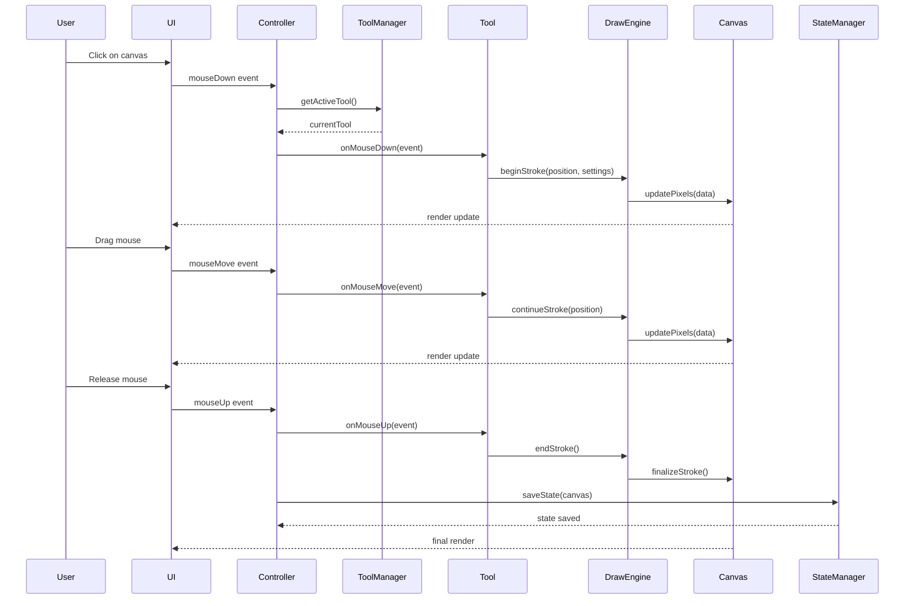

### File Save Operation

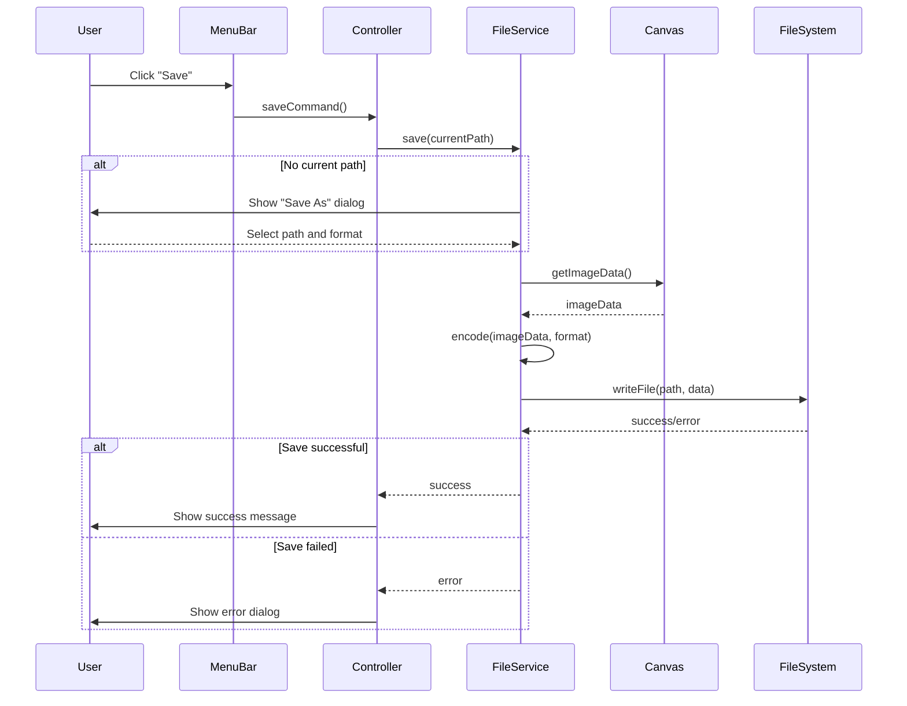

### Undo/Redo Operation

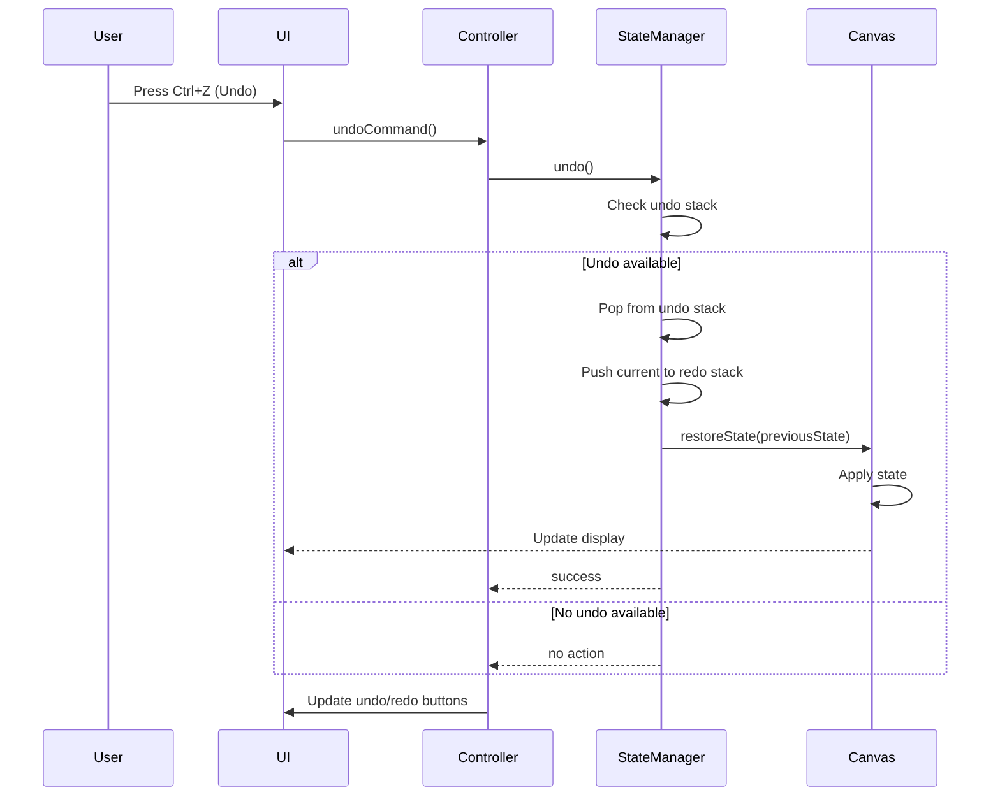

### Color Selection Flow

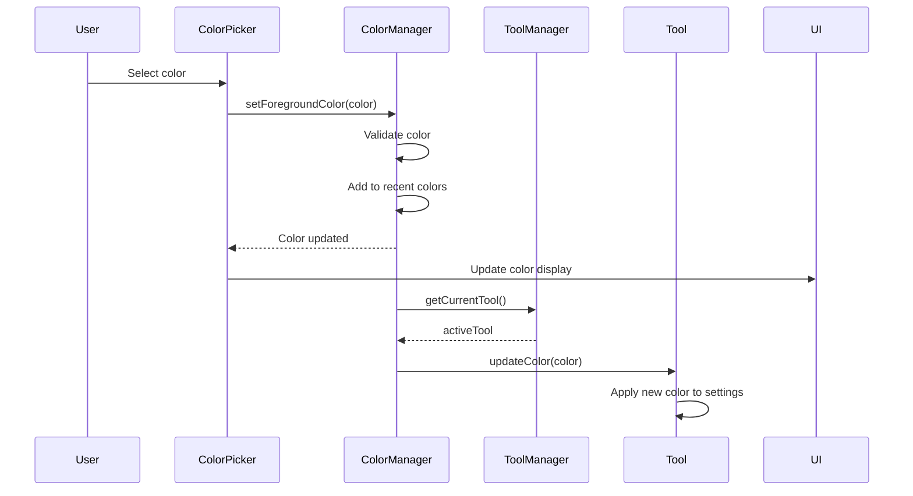

## Data Flow

### Application Startup Data Flow

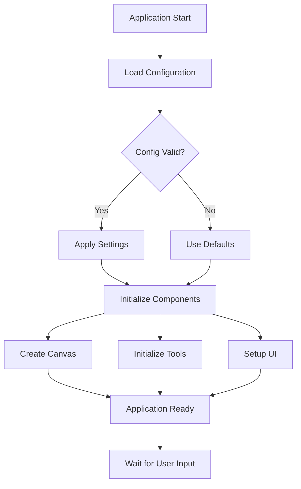

### Drawing Data Flow

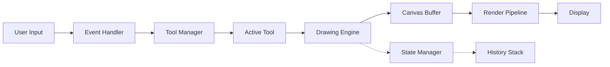

### File Operations Data Flow

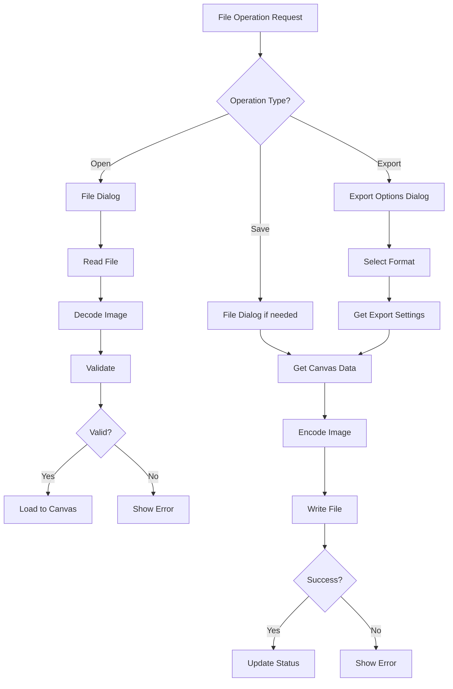

## Event System

### Event Types and Handlers

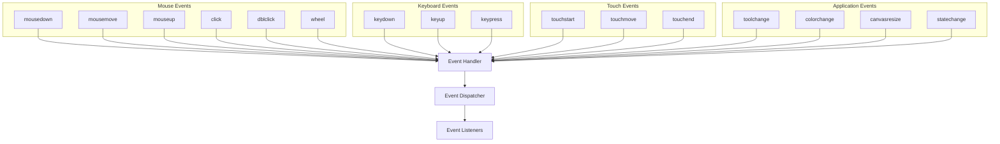

### Event Propagation

```javascript
// Event lifecycle
{
  "phase": "capture",      // Capture phase (top-down)
  "phase": "target",       // Target phase (at element)
  "phase": "bubble",       // Bubble phase (bottom-up)
  "defaultPrevented": false,
  "propagationStopped": false
}
```

### Custom Event System

```javascript
// Event emitter pattern
class EventEmitter {
  constructor() {
    this.events = {};
  }
  
  on(event, listener) {
    if (!this.events[event]) {
      this.events[event] = [];
    }
    this.events[event].push(listener);
  }
  
  emit(event, data) {
    if (!this.events[event]) return;
    this.events[event].forEach(listener => {
      listener(data);
    });
  }
  
  off(event, listener) {
    if (!this.events[event]) return;
    this.events[event] = this.events[event].filter(l => l !== listener);
  }
}
```

## State Management

### Application State Structure

```javascript
{
  // Canvas state
  "canvas": {
    "width": 800,
    "height": 600,
    "zoom": 1.0,
    "pan": { "x": 0, "y": 0 },
    "backgroundColor": "#FFFFFF"
  },
  
  // Tool state
  "tool": {
    "current": "brush",
    "settings": {
      "brush": { "size": 10, "opacity": 1.0, "color": "#000000" },
      "eraser": { "size": 20 },
      "shape": { "type": "rectangle", "filled": false }
    }
  },
  
  // UI state
  "ui": {
    "showGrid": false,
    "showRulers": true,
    "theme": "light",
    "sidebarVisible": true,
    "toolOptionsVisible": true
  },
  
  // File state
  "file": {
    "path": null,
    "modified": false,
    "format": "png"
  },
  
  // History state
  "history": {
    "canUndo": false,
    "canRedo": false,
    "undoStackSize": 0,
    "redoStackSize": 0
  }
}
```

### State Transitions

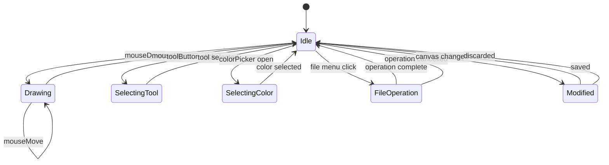

### State Persistence

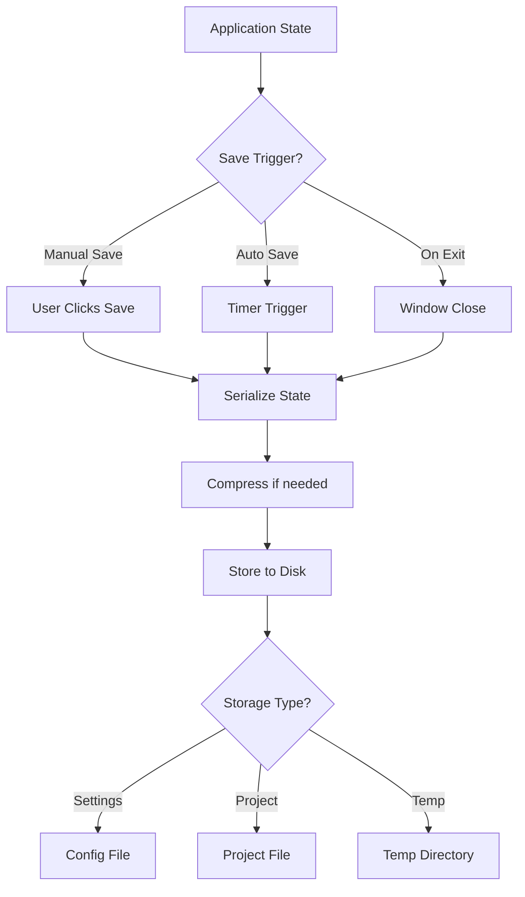

## Plugin Architecture

### Plugin System Design

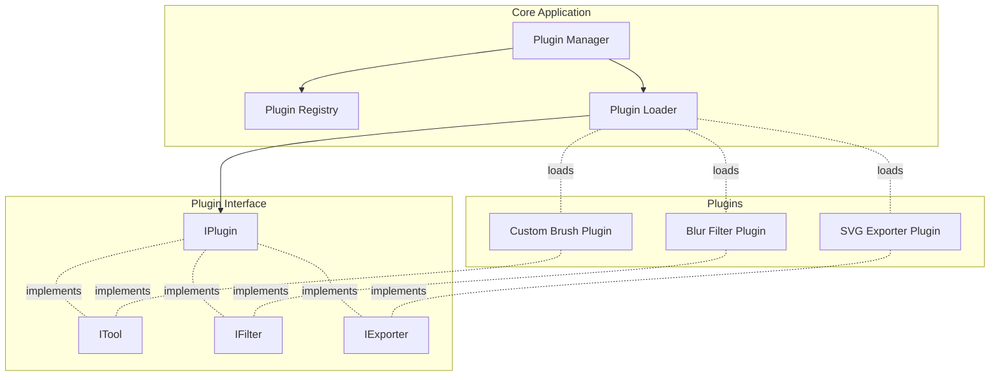

### Plugin Lifecycle

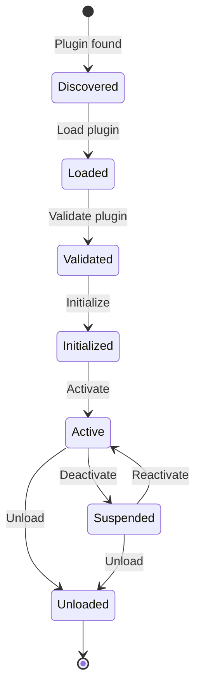

### Plugin API Example

```javascript
// Plugin interface
class IPlugin {
  getName() { throw new Error("Not implemented"); }
  getVersion() { throw new Error("Not implemented"); }
  initialize(context) { throw new Error("Not implemented"); }
  shutdown() { throw new Error("Not implemented"); }
}

// Tool plugin interface
class IToolPlugin extends IPlugin {
  getIcon() { throw new Error("Not implemented"); }
  onActivate() { throw new Error("Not implemented"); }
  onDeactivate() { throw new Error("Not implemented"); }
  onMouseDown(event) { throw new Error("Not implemented"); }
  onMouseMove(event) { throw new Error("Not implemented"); }
  onMouseUp(event) { throw new Error("Not implemented"); }
}

// Example custom tool plugin
class SprayPaintTool extends IToolPlugin {
  getName() { return "Spray Paint"; }
  getVersion() { return "1.0.0"; }
  
  initialize(context) {
    this.canvas = context.canvas;
    this.settings = {
      density: 50,
      radius: 20,
      color: "#000000"
    };
  }
  
  onMouseMove(event) {
    if (!event.isDrawing) return;
    
    // Spray paint logic
    const { x, y } = event.position;
    for (let i = 0; i < this.settings.density; i++) {
      const angle = Math.random() * Math.PI * 2;
      const distance = Math.random() * this.settings.radius;
      const px = x + Math.cos(angle) * distance;
      const py = y + Math.sin(angle) * distance;
      this.canvas.drawPixel(px, py, this.settings.color);
    }
  }
}
```

## Tool System Design

### Tool Abstraction

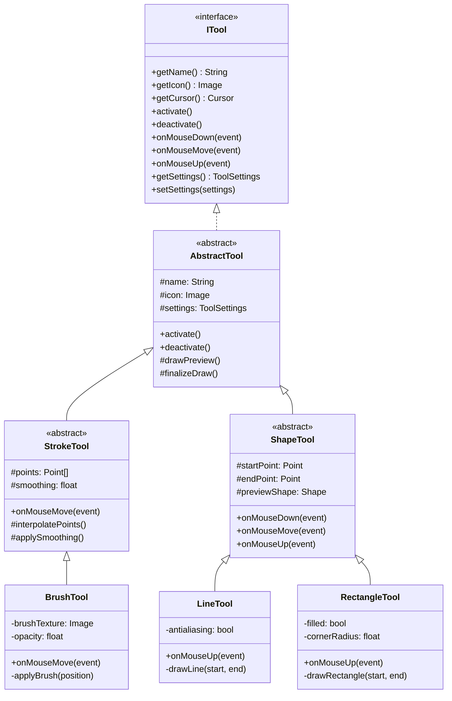

## Drawing Engine Architecture

### Rendering Pipeline

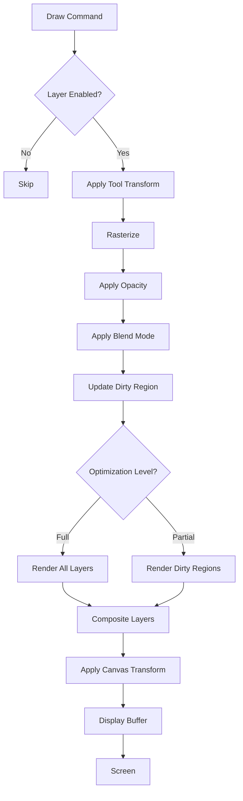

### Layer Blending

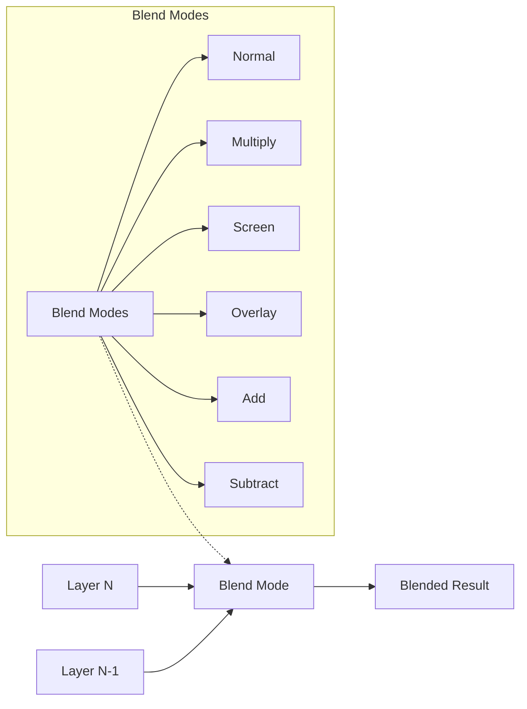

## Performance Optimization Strategies

### Dirty Rectangle Optimization

```javascript
class DirtyRectManager {
  constructor() {
    this.dirtyRegions = [];
  }
  
  addDirtyRect(x, y, width, height) {
    this.dirtyRegions.push({ x, y, width, height });
  }
  
  mergeDirtyRects() {
    // Merge overlapping rectangles
    // Return minimal set of rectangles to redraw
  }
  
  clearDirtyRects() {
    this.dirtyRegions = [];
  }
}
```

### Canvas Tiling for Large Images

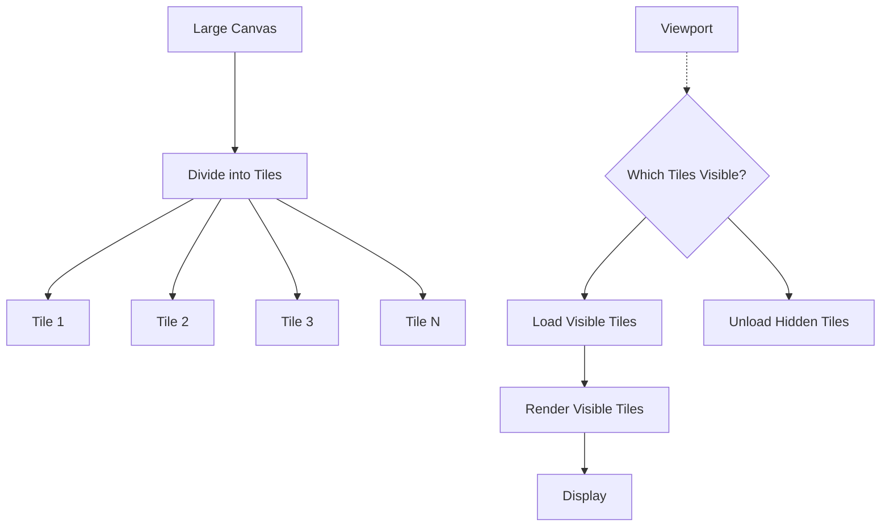

### Brush Stroke Optimization

```javascript
class OptimizedStroke {
  constructor() {
    this.points = [];
    this.minDistance = 2; // Minimum pixel distance between points
  }
  
  addPoint(x, y, pressure = 1.0) {
    if (this.points.length === 0) {
      this.points.push({ x, y, pressure });
      return;
    }
    
    const last = this.points[this.points.length - 1];
    const distance = Math.sqrt((x - last.x) ** 2 + (y - last.y) ** 2);
    
    if (distance >= this.minDistance) {
      this.points.push({ x, y, pressure });
    }
  }
  
  simplify() {
    // Douglas-Peucker algorithm or similar
    // Reduce number of points while maintaining shape
  }
}
```

## Testing Strategy

### Unit Testing Structure

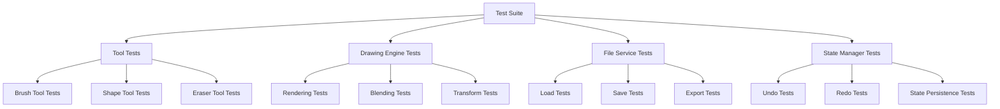

### Integration Testing

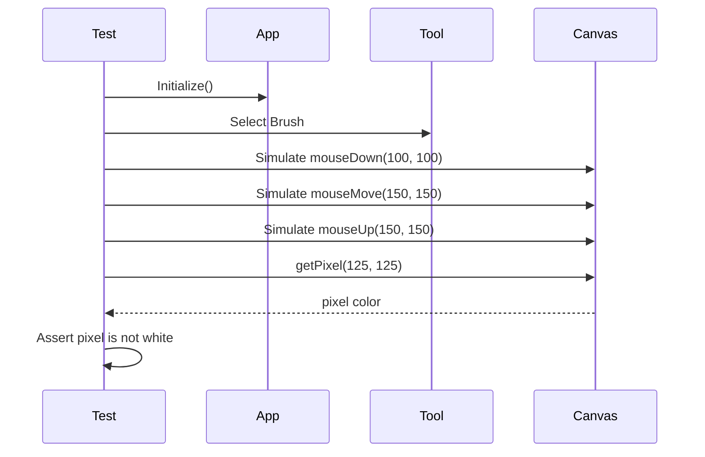

## Error Handling

### Error Hierarchy

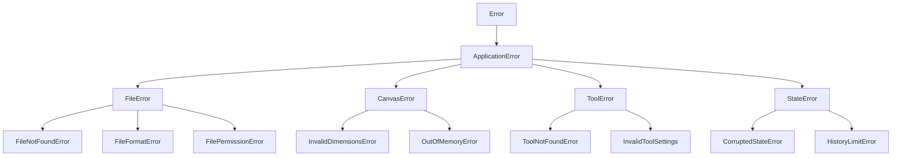

### Error Recovery Strategy

```javascript
class ErrorHandler {
  handle(error) {
    console.error(error);
    
    if (error instanceof FileNotFoundError) {
      this.showDialog("File not found. Please select a valid file.");
    } else if (error instanceof OutOfMemoryError) {
      this.releaseMemory();
      this.showDialog("Out of memory. Try reducing canvas size.");
    } else if (error instanceof CorruptedStateError) {
      this.recoverFromAutosave();
    } else {
      this.showDialog("An unexpected error occurred. Please restart the application.");
      this.logError(error);
    }
  }
  
  recoverFromAutosave() {
    const autosave = this.loadAutosave();
    if (autosave) {
      this.loadState(autosave);
      this.showDialog("Recovered from autosave.");
    }
  }
}
```

## Accessibility Features

### Keyboard Navigation

```javascript
const shortcuts = {
  // File operations
  'Ctrl+N': 'new',
  'Ctrl+O': 'open',
  'Ctrl+S': 'save',
  'Ctrl+Shift+S': 'saveAs',
  
  // Edit operations
  'Ctrl+Z': 'undo',
  'Ctrl+Y': 'redo',
  'Ctrl+Shift+Z': 'redo',
  'Ctrl+C': 'copy',
  'Ctrl+V': 'paste',
  
  // Tool selection
  'B': 'brush',
  'P': 'pencil',
  'E': 'eraser',
  'L': 'line',
  'R': 'rectangle',
  'C': 'circle',
  
  // View
  'Ctrl++': 'zoomIn',
  'Ctrl+-': 'zoomOut',
  'Ctrl+0': 'zoomReset',
  'Ctrl+G': 'toggleGrid',
};
```

### Screen Reader Support

```javascript
class AccessibilityManager {
  announceToolChange(toolName) {
    this.announce(`${toolName} tool selected`);
  }
  
  announceAction(action) {
    this.announce(action);
  }
  
  announce(message) {
    // Use ARIA live regions
    const liveRegion = document.getElementById('aria-live-region');
    liveRegion.textContent = message;
  }
  
  provideAlternativeText() {
    // Provide alt text for UI elements
    // Describe canvas content when possible
  }
}
```

## Internationalization (i18n)

### Translation Structure

```javascript
const translations = {
  en: {
    menu: {
      file: 'File',
      edit: 'Edit',
      view: 'View',
      help: 'Help'
    },
    tools: {
      brush: 'Brush',
      pencil: 'Pencil',
      eraser: 'Eraser',
      line: 'Line',
      rectangle: 'Rectangle'
    },
    messages: {
      saveSuccess: 'File saved successfully',
      saveError: 'Error saving file',
      unsavedChanges: 'You have unsaved changes. Do you want to save?'
    }
  },
  es: {
    menu: {
      file: 'Archivo',
      edit: 'Editar',
      view: 'Ver',
      help: 'Ayuda'
    },
    // ... Spanish translations
  }
  // ... other languages
};
```

This design documentation provides comprehensive coverage of the Paint Application's design, including component interactions, data flow, event systems, state management, and various architectural patterns that support extensibility and maintainability.
