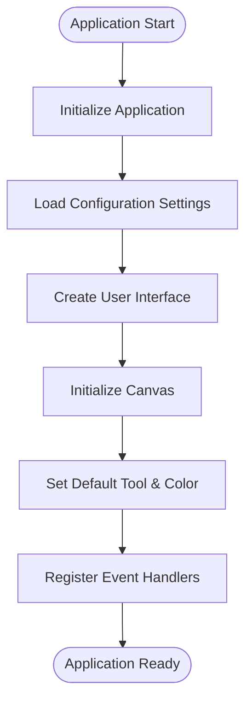
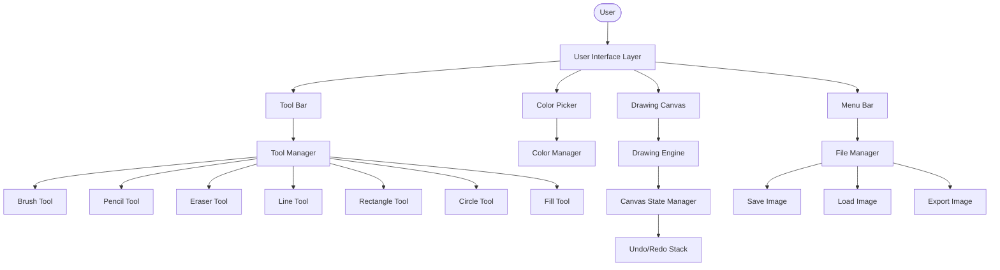
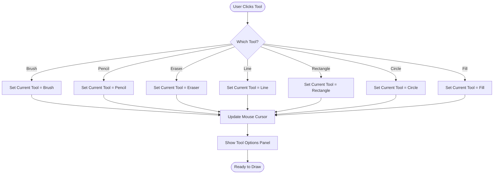
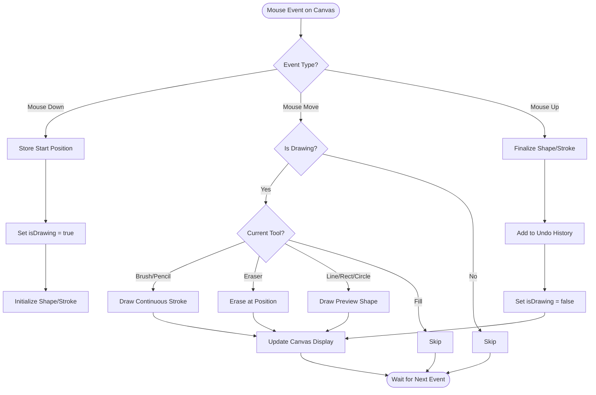
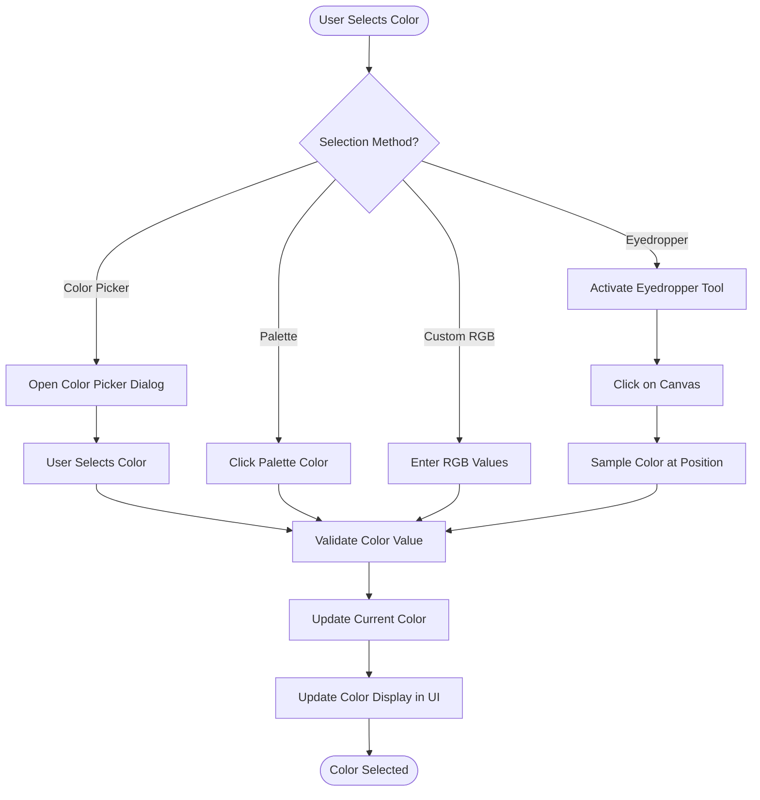
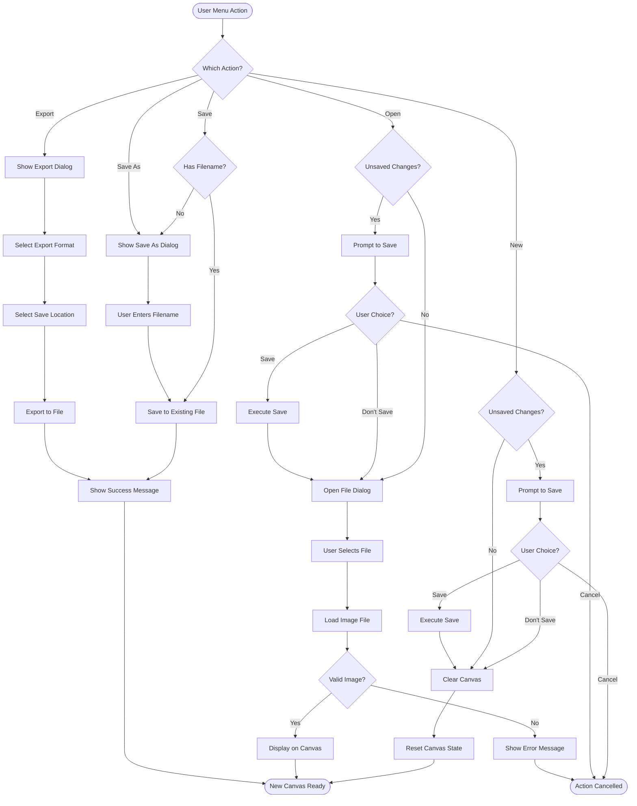
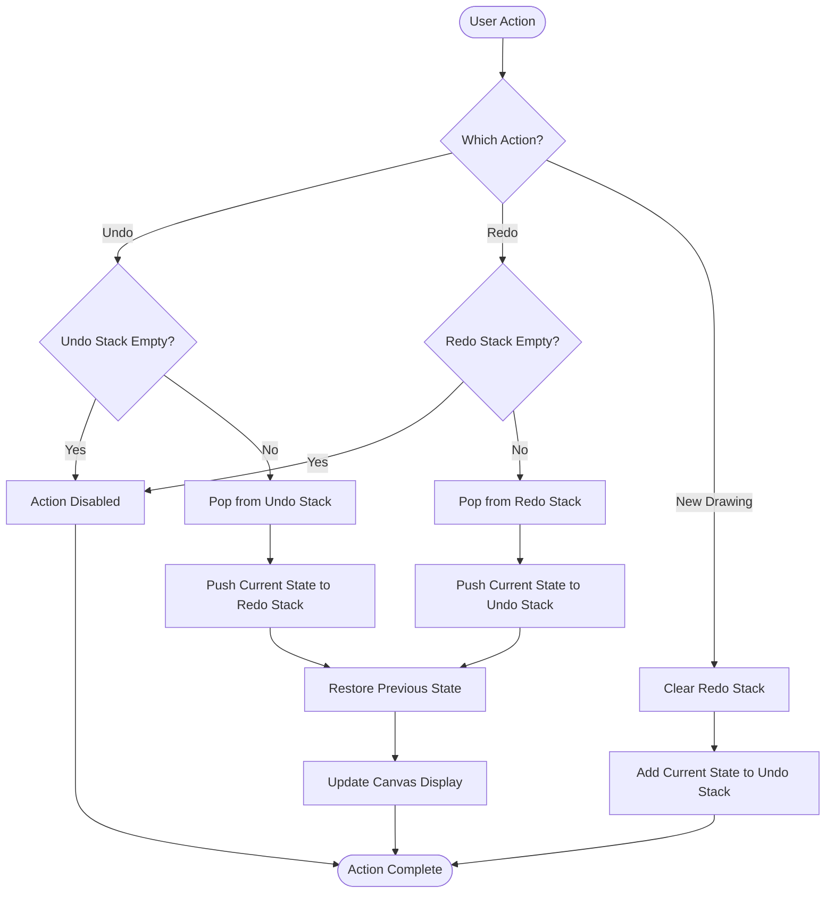
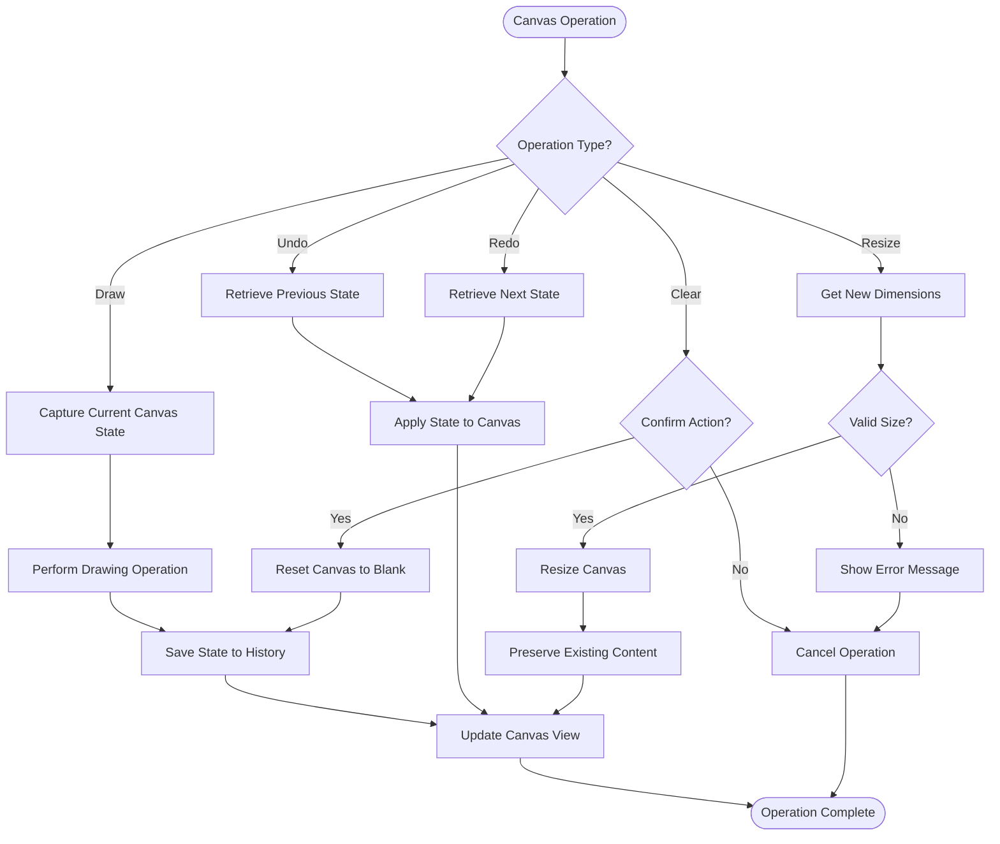

# Paint Application Flowchart

This document contains flowcharts depicting the architecture and flow of a Paint application.

## 1. Application Startup Flow

## 2. Main Application Architecture

## 3. Drawing Tool Selection Flow

## 4. Drawing Event Handling Flow

## 5. Color Selection Flow

## 6. File Operations Flow

## 7. Undo/Redo Flow

## 8. Canvas State Management

## Summary

This flowchart documentation provides a comprehensive overview of a Paint application's architecture and workflows, including:

1. **Application Startup** - How the application initializes
2. **Main Architecture** - Overall structure and component relationships
3. **Tool Selection** - How users switch between drawing tools
4. **Drawing Events** - How mouse events are handled during drawing
5. **Color Selection** - Different methods for choosing colors
6. **File Operations** - Save, load, and export functionality
7. **Undo/Redo** - History management for user actions
8. **Canvas State** - Managing the drawing canvas state

These diagrams can be used as a reference for implementing or understanding the Paint application's functionality.
